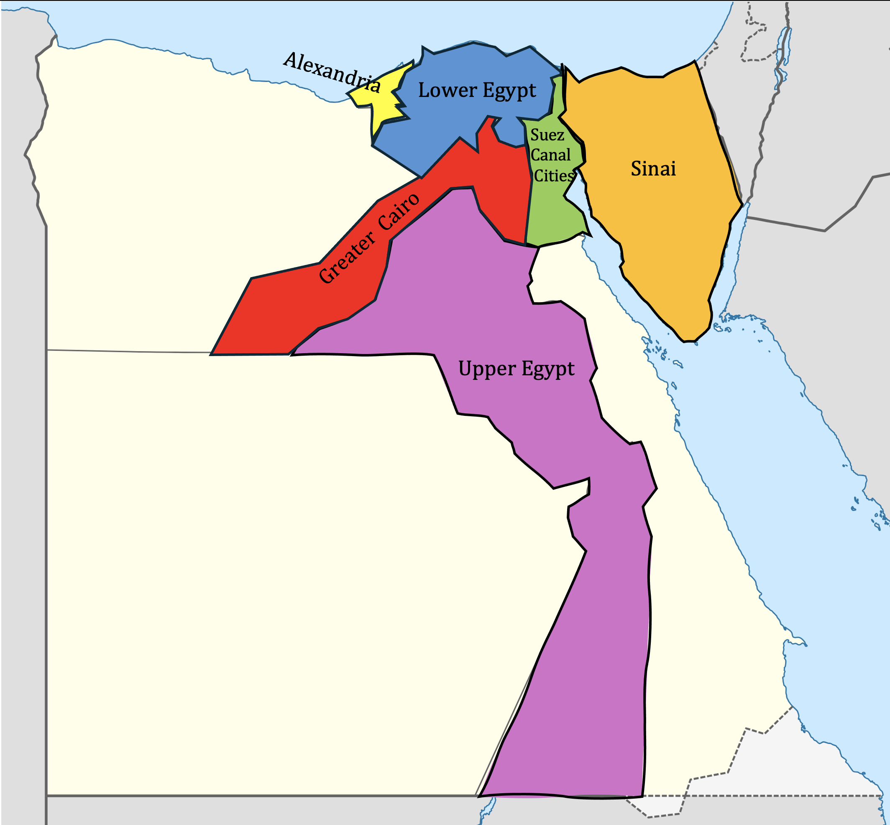

# Beyond the Pyramids

## About

This repository contains the materials for **Beyond the Pyramids: Evaluating Regional and Linguistic Variation in LLMs' Knowledge of Egyptian Culture**, a Bachelor's thesis project in Artificial Intelligence at Vrije Universiteit Amsterdam.

This project adapts the BLEnD framework to the national and regional Egyptian contexts using newly collected datasets of everyday Egyptian cultural questions.

The datasets covers six Egyptian regions: Alexandria, Greater Cairo, Lower Egypt, Upper Egypt, Sinai, and the Suez Canal Cities. Both the question wording and the prompt language were adapted into three language varieties: English, Modern Standard Arabic (MSA), and the Egyptian dialect.

  
</p
The data was collected through a multi-phase Google Forms process. The questions were presented to participants in the Egyptian dialect. Participants had to have lived more than half of their lives in the region they were answering for. 

We evaluated how well Large Language Models answer cultural knowledge questions across these regions and language varieties. The evaluation was done in two parts: automated evaluation and human evaluation. The automated scoring was conducted across 14 models on both Short-Answer Questions(SAQ) and Multiple-Choice Questions(MCQ). Our evaluation used the the inst-4 and pers-3 prompts. Second, the zero-scored SAQ responses in The Egyptian dialect and Modern Standard Arabic(MSA) for GPT-5.4, Qwen2.5-72B, and command-r7b-arabic-02-2025 were manually assigned an applicability score to check whether the answers were still culturally or regionally possible. Responses that were not applicable at all were then categorized by the type of error the model made.

## Data

The human-annotated answers, can be found in the `data/annotations/` directory. This directory includes files for the six Egyptian regions and for Egypt as a whole. The Egypt-wide dataset is created by combining the answers from all the regional datasets.

Each region has two annotation files:

- `{REGION/COUNTRY}_data.json` contains the Egyptian dialect version of the dataset.
- `{REGION/COUNTRY}_MSA_data.json` contains the MSA version of the dataset.

The annotations are the same in both files, but the questions are written in different language varieties. Each file contains a JSON object where the unique question IDs are used as keys. The values include the question, the human annotations, and their vote counts.

The question files are located in the `data/questions/` directory. Each region has two question files:

- `{REGION/COUNTRY}_questions.csv` contains the English and Egyptian dialect questions.
- `{REGION/COUNTRY}_MSA_questions.csv` contains the English and Modern Standard Arabic questions.

The multiple-choice question files can be found in `evaluation/mc_data/{REGION}/`. Each region has three MCQ files:

- `mc_questions_{REGION}_ar.csv` for Egyptian dialect
- `mc_questions_{REGION}_en.csv` for English
- `mc_questions_{REGION}_msa.csv` for Modern Standard Arabic

The answer options are kept the same across the Egyptian dialect and MSA versions, with only the question wording changing. Each file includes the question, the answer options, and the correct answer.

## Code adaptation

The prompt templates are adapted into the in `model_inference.py`. The file contains two prompt settings: one for English and Egyptian dialect, and one for English and MSA. To run a specific setting, uncomment the prompt set you want to use and comment out the other one.

Our `evaluation_utils.py` combines the helper parts from BLEnD’s `utils.py` and `evaluation_utils.py`. From `utils.py`, it keeps the general idea of having helper functions for model access, JSON extraction, CSV writing, and simple format checks. However, it is simplified for this project by only supporting API-based inference through OpenAI, Anthropic, and Hugging Face. From BLEnD’s `evaluation_utils.py`, it keeps the functions for loading the question and annotation files.

The adapted `eval.py` combines the short-answer evaluation parts that were originally split across BLEnD’s `evaluate.py`, `evaluation_utils.py`, and `exact_match.py`. From `evaluate.py`, it keeps the role of running the evaluation and saving the final short-answer scores. From `evaluation_utils.py`, it keeps the logic for reading model response files, matching responses by question ID, and removing the prompt from the model answer if the model repeated it. From `exact_match.py`, it keeps the soft exact-match scoring logic, but this is now integrated directly into `eval.py` instead of being kept in a separate file.

For Arabic scoring, the adapted code also adds Arabic-specific normalization before Qalsadi lemmatization, which helps handle spelling differences and surface-form variation in MSA and Egyptian dialect more consistently.

For the MCQ evaluation, we used GPT-5.4 for the meaning-based similarity check between answer options and for generating dummy options when there were not enough valid regional distractors.

## How to run the code

### Run multiple_choice_generation.py

python multiple_choice_generation.py \
  --lang {language_variety} \ en or ar
  --question_dir {folder_containing_question_csv_files} \
  --annotation_dir {folder_containing_annotation_json_files} \
  --mc_dir {folder_where_generated_mcq_files_will_be_saved} \
  --target_region {region_name}

### Note on MSA MCQ Files

The multiple_choice_generation.py script does not have a separate `msa` mode for {language_variety}. To create the MSA MCQ files, I reused the Arabic MCQ files and replaced the Egyptian dialect questions/prompts with their MSA versions. The answer choices, distractors, question IDs, and correct labels were kept the same to make the Egyptian dialect and MSA results directly comparable.

### Run multiple_choice_evaluation.py
runs multiple-choice evaluation across several models, all regions, and all language varieties.

bash run_all_mc_regions.sh

### SAQ Model Inference

`model_inference.py` generates model responses for the Short-Answer Questions.

First, in `prompt_maker()`, choose the Arabic template you want to use by uncommenting either the Egyptian dialect template or the Modern Standard Arabic template.

Second, fill in the required values inside the call to `prompt_maker()` in `csv_maker()`.

`question_file` is the question CSV file for the selected region.

`region_en` is the English region name used in the prompt.

`region_ar` is the Arabic region name used in the prompt.

At the bottom of `model_inference.py`.

`model_name` is the model you want to run.

`csv_maker("{region_name}", model_name)` creates the SAQ prompt CSV files for the selected region and model.

`fill_csv_responses("{region_name}", model_name)` sends the prompts to the selected model and saves the model responses.

### SAQ Evaluation

The file `eval.py` is used to evaluate the model responses generated for the SAQ.

To evaluate  all models:

python eval.py \
  --country {region_name} \
  --response_dir {folder_containing_model_responses} \
  --annotation_dir {folder_containing_annotation_json_files} \
  --all_models_region

## Citation

This project adapts the BLEnD framework. If you use this repository, please also cite the original BLEnD paper.
